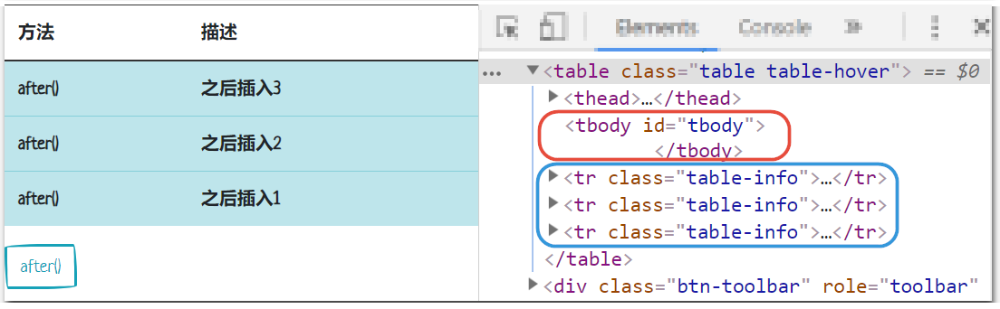

## 添加/删除CLASS

```javascript
$("div").addClass("classOne").removeClass("classTwo");
```

## 插入HTML

### after()

```javascript
// after()	在匹配的元素之后插入内容。
$("#after").click(function () {
    $("#tbody").after(
        '<tr class="table-info">' +
        '<td scope="row">after()</td>' +
        '<td>在匹配的元素之后插入内容。</td>' +
        '</tr>'
    );
});
```


