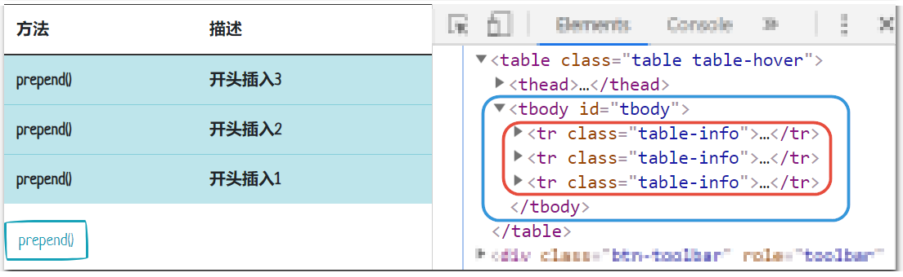
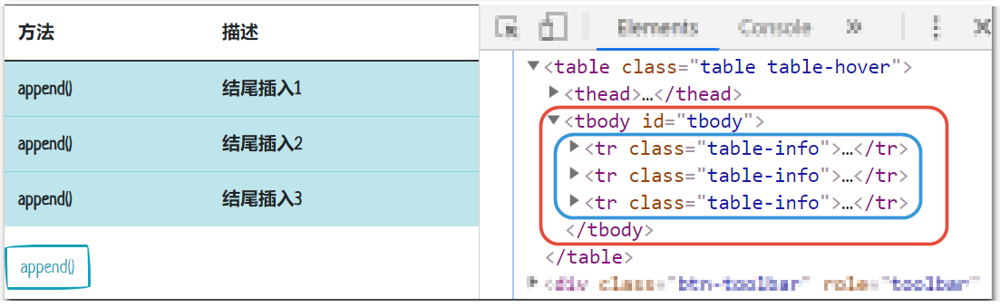

本文列出jQuery中几乎所有的DOM操作方法。使用这些方法可以非常简单方便地对文档进行操作处理。

## 添加/删除 class

```javascript
$("div").addClass("classOne").removeClass("classTwo");
```

## 插入 html

### after()

```javascript
var i = 0

// after()	在匹配的元素之后插入内容。
$("#after").click(function () {
    i += 1;
    $("#tbody").after(
        '<tr class="table-info">' +
        '<td scope="row">after()</td>' +
        '<td>之后插入' + i +
        '</td>' +
        '</tr>'
    );
});
```


### prepend()

```javascript
var i = 0

// prepend()	向匹配元素集合中的每个元素开头插入由参数指定的内容。
$("#prepend").click(function () {
    i += 1;
    $("#tbody").prepend(
        '<tr class="table-info">' +
        '<td scope="row">prepend()</td>' +
        '<td>开头插入' + i +
        '</td>' +
        '</tr>'
    );
});
```



### append()

```javascript
var i = 0

// append()	向匹配元素集合中的每个元素结尾插入由参数指定的内容。
$("#append").click(function () {
    i += 1;
    $("#tbody").append(
        '<tr class="table-info">' +
        '<td scope="row">append()</td>' +
        '<td>结尾插入' + i +
        '</td>' +
        '</tr>'
    );
});
```

